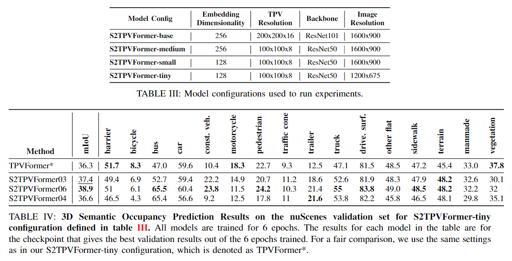

___
# S2TPVFormer: Improving 3D Semantic Occupancy Prediction using Spatiotemporal Transformers
___

> [Sathira Silva](https://sathiiii.github.io/)*, [Savindu Wannigama](https://savinduwannigama.github.io/)\*, [Prof. Roshan Ragel](https://scholar.google.com/citations?user=UTYj8usAAAAJ&hl=en) $\dagger$, [Gihan Jayatilaka](https://scholar.google.com/citations?user=ZsJpIO8AAAAJ&hl=en) $\ddagger$

\* Equal contribution $\dagger$ Project Supervisor $\ddagger$ Project Co-supervisor

## News

- [25/01/2024]: [Paper (preprint) released in arxiv](https://arxiv.org/abs/2401.13785)
- [04/01/2024]: [Paper (preprint) released in ResearchGate](https://www.researchgate.net/publication/377116622_S2TPVFormer_Spatio-Temporal_Tri-Perspective_View_for_temporally_coherent_3D_Semantic_Occupancy_Prediction)

## Introduction

Temporal reasoning holds equal importance to spatial reasoning in a cognitive perception system. In human perception, temporal information is crucial for identifying occluded objects and determining the motion state of entities. A system proficient in spatiotemporal reasoning excels in making inferences with high temporal coherence. While previous works emphasize the significance of temporal fusion in 3D object detection, earlier attempts at 3D Semantic Occupancy Prediction (3D SOP) often overlooked the value of incorporating temporal information. The current state-of-the-art in 3D SOP literature seldom exploits temporal cues. This is evident in [TPVFormer](https://github.com/wzzheng/tpvformer)’s SOP visualizations, where adjacent prediction frames lack temporal coherence as they rely solely on the current time step for semantic predictions. 

This work introduces S2TPVFormer, a variant of [TPVFormer](https://github.com/wzzheng/tpvformer), which utilizes a spatiotemporal transformer architecture inspired by [BEVFormer](https://github.com/fundamentalvision/BEVFormer), for dense and temporally coherent 3D semantic occupancy prediction. Leveraging TPV (Tri-Perspective View) representation, the model’s spatiotemporal encoder generates temporally rich embeddings, fostering coherent predictions. The study proposes a novel **Temporal Cross-View Hybrid Attention** mechanism, enabling the exchange of spatiotemporal information across different views. To illustrate the efficacy of temporal information incorporation and the potential of the new attention mechanism, the research explores three distinct temporal fusion paradigms.

### Overview of our Contributions

To summarize, this work contributes in the following ways,
- We pioneer the use of TPV representation for embedding spatiotemporal information in 3D scenes within the domain of vision-centric SOP and the broader 3D perception literature.
- We introduce a novel temporal fusion workflow for TPV representation, analyzing how CVHA facilitates the sharing of spatiotemporal information across the three planes.
- The lower parameter model of our method achieves a significant **3.1%** improvement in mIoU for 3D SOP when evaluated on the [nuScenes](https://www.nuscenes.org/nuscenes/) validation dataset with [TPVFormer](https://github.com/wzzheng/tpvformer)’s sparse pseudo-voxel ground truth, compared to TPVFormer.

## Results



## Related Projects

Our code is based on [TPVFormer](https://github.com/wzzheng/tpvformer) and [BEVFormer](https://github.com/fundamentalvision/BEVFormer). Many thanks to them!

## Team

- E/17/331 - SILVA H.S.C. - [e17331@eng.pdn.ac.lk](mailto:e17331@eng.pdn.ac.lk)
- E/17/369 - WANNIGAMA S.B. - [e17369@eng.pdn.ac.lk](mailto:e17369@eng.pdn.ac.lk)

## External Links

- [Department of Computer Engineering](http://www.ce.pdn.ac.lk/)
- [Faculty of Engineering](http://www.eng.pdn.ac.lk/)
- [University of Peradeniya](https://eng.pdn.ac.lk/)

## Citation

If this work is helpful for your research, please consider citing:
```
@article{silva2024s2tpvformer,
    title={S2TPVFormer: Spatio-Temporal Tri-Perspective View for temporally coherent 3D Semantic Occupancy Prediction},
    author={Sathira Silva and Savindu Bhashitha Wannigama and Roshan Ragel and Gihan Jayatilaka},
    journal={arXiv:2401.13785},
    year={2024},
}
```
